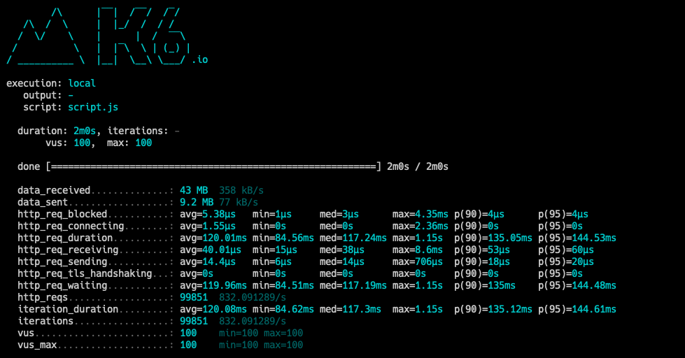

# DataChefAnalytics

DataChefAnalytics is a simple application to serve banners for one of many websites owned by our client! It renders banners based on their revenue or visit count. 

# Architecture
This application is designed with scalability in mind.


## Components

### Loader 
Loader is a simple service that could be run as a Lambda function. It is responsible for loading files and storing them into the corresponding Kafka topics based on time slots.
 
### Aggregator
This application is designed to be highly available and fast. Aggregator service is the heart of the system which aggregates and stores the data in a format that is very fast to read.

### Data model
In order to get the list of most profitable banners or most viewed ones, the aggregated data are stored in Redis using the following data model:

Key | filed | value
--- | --- | ---
R-C<**campaign-id**>-<**time-slot**>* | <**banner-id**> | *revenue*
C-C<**campaign-id**>-<**time-slot**>* | <**banner-id**> | *count*
I-C<**campaign-id**>-<**time-slot**>* | - | Set[<**banner-id**>] 

# Setup

## Prerequisites
Here are the tools you'll need before you start running the application:

- JDK
- [sbt](https://www.scala-sbt.org/1.0/docs/Setup.html)
- [Docker](https://docs.docker.com/install/)
- [Docker Compose](https://docs.docker.com/compose/install/)

To build the project run `./setup.sh`. This command generates all of the artifacts and Docker images required to run the application.

# Run

Please run `./start.sh` to start services. This command not only starts Docker containers but also loads sample CSV files into the system.

# Test

Using the following command you can make a call to get a list of banners for a given campaign:

```bash
curl -X GET "localhost:8080/campaigns/19" -H "accept: application/json"
```

# Performance
DataChefAnalytics is able to handle more than 600 ops (> 37K requests per minute) on a single node installation. Bear in mind that the application is designed to be scalable. 
It means by adding extra nodes and using clustered instances of Kafka and Redis it can handle even more load.

